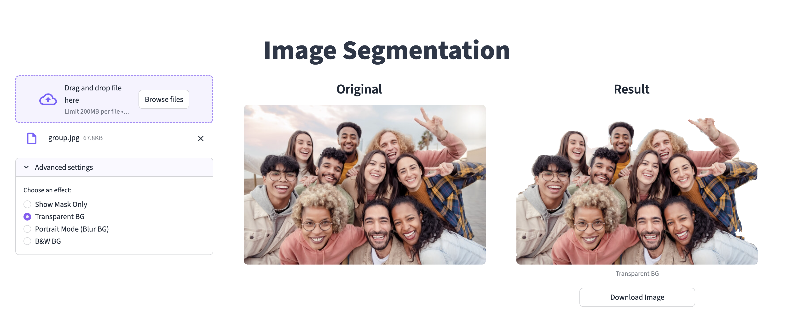
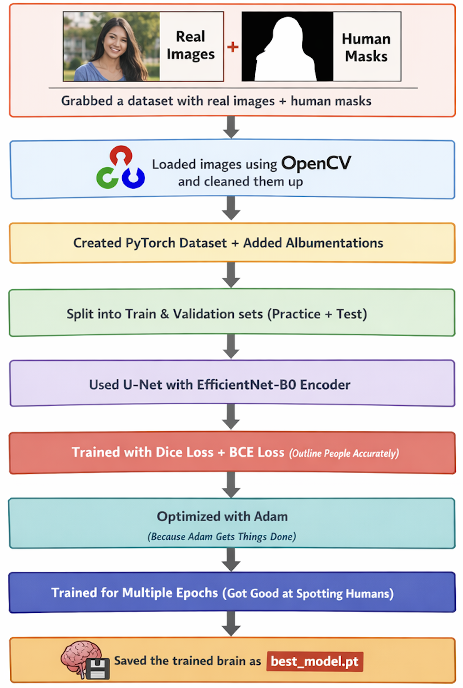

# Deep Learning with PyTorch – Image Segmentation

This project follows the **Coursera course: Deep Learning with PyTorch – Image Segmentation**  
*(Verification ID: TQXF0B23K30A)*.

## SaaS Web Application

A lightweight **SaaS web application** using **Streamlit** allows users to upload an image, run it through the trained PyTorch model, and download the resulting images.

<div align="center">
  
  
</div>

### Tool Options Available:
- **Show Mask Only**: Displays the raw segmentation mask.  
- **Transparent BG**: Removes the background.  
- **Portrait Mode**: Applies a Gaussian blur to the background.  
- **B&W BG**: Converts the background to black and white while keeping the subject in color.  

---

## 🛠️ Training Process

The deep learning model is based on the **U-Net** architecture with an **EfficientNet-b0** encoder. Using PyTorch, it was trained to map input images to binary masks, effectively learning to identify and separate the main subject from the background.

<div align="center">
  
</div>

---


##  How to Run Locally

1. **Activate the virtual environment**:
   ```bash
   source venv/bin/activate
   ```
2. **Install dependencies**:
   ```bash
   pip install -r requirements.txt
   ```
3. **Start the Streamlit application**:
   ```bash
   streamlit run app.py
   ```
