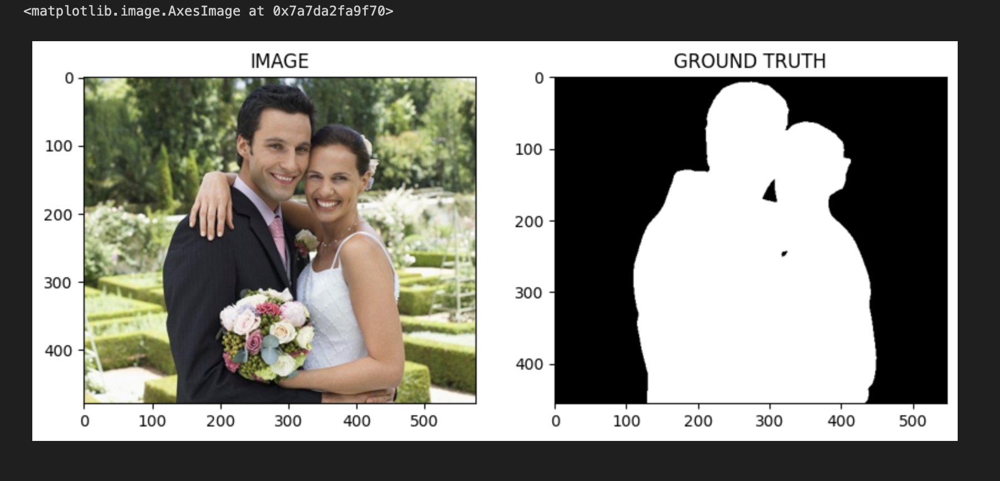

# Deep Learning with PyTorch – Image Segmentation

Turns out, with the right dataset and a segmentation model, building your own background remover is actually pretty straightforward. I developed this project after completing a Coursera course: **Deep Learning with PyTorch – Image Segmentation**  
*(Verification ID: TQXF0B23K30A)*.


## 🛠️ The Training Process

This deep learning model is based on the **U-Net** architecture with an **EfficientNet-b0** encoder. Using PyTorch, it was trained to map input images to binary masks, effectively learning to identify and separate the main subject from the background pixel by pixel. 

<div align="center">
  
  
</div>
<p align="center"><em>Example of training data and the corresponding segmentation masks.</em></p>

---

##  The Web App Showcase

To make this model easily accessible, I built a lightweight **SaaS web application** using **Streamlit**. The app allows users to upload any image, run it through the trained PyTorch model on the fly, and download beautiful results.

<div align="center">
  
  
</div>
<p align="center"><em>Real-time inference running directly in the browser.</em></p>

###  Tool Options Available:
- **Show Mask Only**: Displays the raw, AI-generated segmentation mask.
- **Transparent BG**: Completely removes the background, leaving the subject on a clear canvas (ready for graphic design).
- **Portrait Mode**: Applies a Gaussian blur to the background while keeping the subject deeply in focus.
- **B&W BG**: Converts the background to black and white while keeping the main subject vividly colorized.

---

##  How to Run Locally

1. **Activate the virtual environment**:
   ```bash
   source venv/bin/activate
   ```
2. **Install dependencies**:
   ```bash
   pip install -r requirements.txt
   ```
3. **Start the Streamlit application**:
   ```bash
   streamlit run app.py
   ```
